# Grace Store - System Architecture & Component Mapping

## 1. System Architecture Diagram

```mermaid
graph TD
    subgraph ClientLayer ["1. Client / Frontend Layer (User Interaction)"]
        UI_Home["Home Page<br/>src/app/page.tsx"]
        UI_Products["Products Catalog<br/>src/app/products/page.tsx"]
        UI_ProductDetail["Product Detail<br/>src/app/products/[id]/page.tsx"]
        UI_Cart["Cart Page<br/>src/app/cart/page.tsx"]
        UI_Checkout["Checkout Page<br/>src/app/checkout/page.tsx"]
        UI_Dashboard["Admin Dashboard<br/>src/app/dashboard/page.tsx"]
        UI_Login["[PLANNED] Secure Login Page<br/>src/app/login/page.tsx"]
        
        Nav["Navigation Bar<br/>src/app/NavBar.tsx"]
        GlobalStyles["Global Styles & Theme<br/>src/app/globals.css"]
    end

    subgraph StateLayer ["2. Client State Management"]
        CartCtx["Cart Context & Provider<br/>src/lib/CartContext.tsx"]
    end

    subgraph BackendLayer ["3. Backend & API Layer (Next.js App Router)"]
        API_Products["Products API Endpoint<br/>src/app/api/products/route.ts<br/>(GET, POST)"]
        API_ProductID["Product Detail API<br/>src/app/api/products/[id]/route.ts<br/>(GET, PUT, DELETE)"]
        API_Purchase["Purchase / Checkout API<br/>src/app/api/products/purchase/route.ts<br/>(POST)"]
        API_Auth["[PLANNED] Auth API Endpoint<br/>src/app/api/auth/route.ts<br/>(Login, Register, Logout)"]
    end

    subgraph DatabaseLayer ["4. Database & ORM Layer"]
        MongoConn["MongoDB Connection Client<br/>src/lib/mongodb.ts"]
        Model_Product["Product Mongoose Schema<br/>src/models/Product.ts"]
        Model_User["[PLANNED] User Mongoose Schema<br/>src/models/User.ts"]
        MongoDB[("MongoDB Database<br/>'grace-store'")]
    end

    %% Component Relationships & Interconnections
    UI_Home --> Nav
    UI_Products --> Nav
    UI_Cart --> Nav
    UI_Checkout --> Nav
    UI_Dashboard --> Nav
    UI_Login --> Nav

    UI_Products -.-> CartCtx
    UI_ProductDetail -.-> CartCtx
    UI_Cart -.-> CartCtx
    UI_Checkout -.-> CartCtx

    UI_Products -->|HTTP Fetch| API_Products
    UI_ProductDetail -->|HTTP Fetch| API_ProductID
    UI_Dashboard -->|HTTP CRUD| API_Products
    UI_Dashboard -->|HTTP CRUD| API_ProductID
    UI_Checkout -->|HTTP POST| API_Purchase
    UI_Login -->|HTTP POST| API_Auth

    API_Products --> Model_Product
    API_ProductID --> Model_Product
    API_Purchase --> Model_Product
    API_Auth --> Model_User

    Model_Product --> MongoConn
    Model_User --> MongoConn
    MongoConn -->|Mongoose Driver| MongoDB
```

---

## 2. Component & File Mapping Matrix

Below is the exhaustive mapping of every system element to its exact project file path and language:

| Architectural Element | Component Description | File Path | Primary Language / Technologies | Status |
| :--- | :--- | :--- | :--- | :--- |
| **1. Web Pages (Frontend)** | Home Landing Page | [src/app/page.tsx](file:///c:/Users/Admin/Documents/Projects/grace-store/grace_store/src/app/page.tsx) | TypeScript / React (TSX) | Existing |
| | Products Listing Page | [src/app/products/page.tsx](file:///c:/Users/Admin/Documents/Projects/grace-store/grace_store/src/app/products/page.tsx) | TypeScript / React (TSX) | Existing |
| | Single Product Details Page | [src/app/products/[id]/page.tsx](file:///c:/Users/Admin/Documents/Projects/grace-store/grace_store/src/app/products/[id]/page.tsx) | TypeScript / React (TSX) | Existing |
| | Shopping Cart View | [src/app/cart/page.tsx](file:///c:/Users/Admin/Documents/Projects/grace-store/grace_store/src/app/cart/page.tsx) | TypeScript / React (TSX) | Existing |
| | Order Checkout Page | [src/app/checkout/page.tsx](file:///c:/Users/Admin/Documents/Projects/grace-store/grace_store/src/app/checkout/page.tsx) | TypeScript / React (TSX) | Existing |
| | Inventory & Admin Dashboard | [src/app/dashboard/page.tsx](file:///c:/Users/Admin/Documents/Projects/grace-store/grace_store/src/app/dashboard/page.tsx) | TypeScript / React (TSX) | Existing |
| | Main Application Root Layout | [src/app/layout.tsx](file:///c:/Users/Admin/Documents/Projects/grace-store/grace_store/src/app/layout.tsx) | TypeScript / React (TSX) | Existing |
| | Top Header Navigation Bar | [src/app/NavBar.tsx](file:///c:/Users/Admin/Documents/Projects/grace-store/grace_store/src/app/NavBar.tsx) | TypeScript / React (TSX) | Existing |
| **2. Secure Login (Upcoming)** | User Login Page | `src/app/login/page.tsx` | TypeScript / React (TSX) | **To Be Created** |
| | User Registration Page | `src/app/register/page.tsx` | TypeScript / React (TSX) | **To Be Created** |
| | Auth API Route (JWT / Sessions) | `src/app/api/auth/route.ts` | TypeScript (Node.js) | **To Be Created** |
| | User Database Schema | `src/models/User.ts` | TypeScript / Mongoose | **To Be Created** |
| **3. API Layer (Next.js)** | Fetch & Create Products API | [src/app/api/products/route.ts](file:///c:/Users/Admin/Documents/Projects/grace-store/grace_store/src/app/api/products/route.ts) | TypeScript (Node.js API Route) | Existing |
| | Get, Update, Delete Product API | [src/app/api/products/[id]/route.ts](file:///c:/Users/Admin/Documents/Projects/grace-store/grace_store/src/app/api/products/[id]/route.ts) | TypeScript (Node.js API Route) | Existing |
| | Process Purchase API | [src/app/api/products/purchase/route.ts](file:///c:/Users/Admin/Documents/Projects/grace-store/grace_store/src/app/api/products/purchase/route.ts) | TypeScript (Node.js API Route) | Existing |
| **4. Database Layer** | MongoDB Connection Utility | [src/lib/mongodb.ts](file:///c:/Users/Admin/Documents/Projects/grace-store/grace_store/src/lib/mongodb.ts) | TypeScript / Mongoose Driver | Existing |
| | Product Mongoose Model | [src/models/Product.ts](file:///c:/Users/Admin/Documents/Projects/grace-store/grace_store/src/models/Product.ts) | TypeScript / Mongoose Schema | Existing |
| | MongoDB Engine | Local / Atlas Database Instance (`grace-store`) | NoSQL / Document Store | External Service |
| **5. Other Major Components** | Shopping Cart Context & State | [src/lib/CartContext.tsx](file:///c:/Users/Admin/Documents/Projects/grace-store/grace_store/src/lib/CartContext.tsx) | TypeScript / React Context API | Existing |
| | Global Design System & Styling | [src/app/globals.css](file:///c:/Users/Admin/Documents/Projects/grace-store/grace_store/src/app/globals.css) | Vanilla CSS | Existing |
| | Next.js Server & Framework Config | [next.config.ts](file:///c:/Users/Admin/Documents/Projects/grace-store/grace_store/next.config.ts) & [package.json](file:///c:/Users/Admin/Documents/Projects/grace-store/grace_store/package.json) | TypeScript & JSON | Existing |
